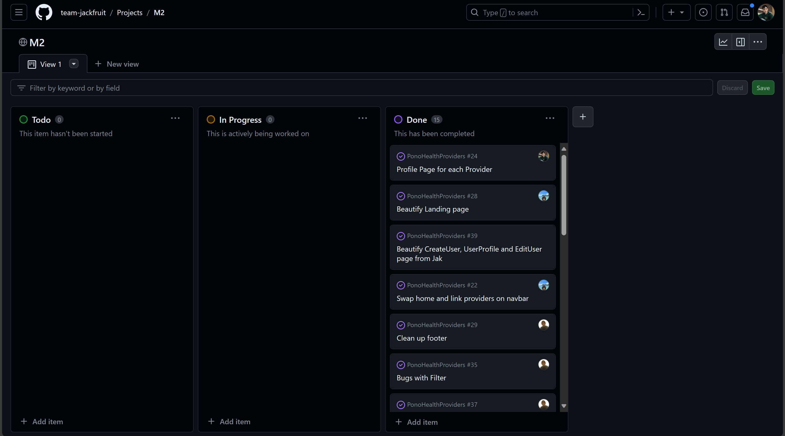

## Introduction

To many, coding may seem like a big hassle. You write all this code so that you can print a coherent sentence to the console. But my Software Engineering class helped me understand and learn many ways to make code work for us, and keep our coding organized and understandable. I’ll define and review the ideas of functional programming, coding standards, issue-driven project management, and agile project management to identify the many ways we can make code work for us.

## Functional Programming

A foundational idea we explored in our Software Engineering class was the idea of a functional programming language. Many computer science majors begin their exploration into computer science by learning Python or Javascript since they are both object-oriented programming languages. Object-oriented programming (OOP) is a method of programming that centers itself around treating data as objects. Due to OOP’s ability to be easily understood by a complete novice in the industry, it’s an easy gateway into developing code but doesn’t explore functional programming which can make writing code a lot easier and efficient. For example, in OPP, we can create a car object and give it attributes such as color, size, model, etc. OOP relies heavily on the encapsulation of its functions, meaning the functions that work for one object won't exactly work for another. This is what differentiates functional programming. By having functions as a first-class data structure, functional programming decreases the redundancies in coding multiple functions, when we could use the same functions for different ‘objects.’ By developing a stronger understanding of functional programming, we can more efficiently utilize functions for multiple purposes, decreasing the need for redundant code. We were able to better explore functional programming by actually writing code using a functional programming language such as Javascript. We took the first couple of weeks in our semester to develop a basic understanding of Javascript, then built upon that knowledge with more assignments that must be written in Javascript. For example, we started by learning Javascript basics through an online course, then explored using underscore functions, which allowed us to do more complex functions with less code writing. 

Here is an example of some code using underscore that displayed a list of campus degrees using minimal code:

```
function listCampusDegrees(data){
	let object = _.groupBy(data, "CAMPUS");
  return _.mapObject(object, totalDegrees);
```

## Coding Standards

My professor in my Software Engineering class preaches the importance of having a good coding standard for all of our code, and I agree. Before someone can understand what our code does, without a good coding standard, the person needs to overcome the additional obstacle of deciphering the format of our code. By implementing a coding standard, we craft a convention for coding that enables us (and others reading our code) to have a clear understanding of the code we create. In our software engineering course, we navigated through a module that centered around establishing a consistent coding standard. While the initial setup for the coding standard felt a bit tedious it paid off when I realized how nice it is to have robust and cleanly formatted code. Node.js and ESlint were the tools of choice for implementing this formatting within our integrated development environment (IDE). Dealing with ESlint did induce some initial stress since it was very different from a format for coding that I was familiar with. When first using it, I remember seeing a screen of red errors, which were not errors in the code, but just errors in the way that the code was displayed. What this module helped me with in Software Engineering was learning to be consistent and making code user-friendly for other people. Computer programmers are so used to only us and the professor reading our code, but once you get into groups and work on a coding project together, you realize how useful it is to ensure that others can understand the code that you produced. This overall makes the coding process a lot easier since you can easily understand your own and other people's code.

##  Issue Driven Project Management

On the topic of working with others, another aspect of programming that I learned of was issue-driven project management. For my Software Engineering class final project, I had to work with a team to develop an application that solves a real-world problem. This was the main project in this class that required active communication and collaboration with other classmates. What we learned as a good way to organize tasks that need to be completed for the project was utilizing the concept of issue-driven project management. Issue-driven project management is a style of management where you organize your branches in a project based on the ‘issues’ that need to be completed. An issue is a specific task or problem that occurs or needs to be implemented into your code. In our project, some sample issues were creating a filter page, fixing the user profile edit tab, or implementing an upload image feature. It can be overwhelming if you have an application that contains many flaws and features that you want to add, but by breaking it apart into issues, it is much easier to digest what exactly needs to be completed. Issues also have to capacity to be sorted by priority, so you can determine which features need to be added or what needs to be fixed first. What this module taught me was organization skills, which overall decreased the time needed to plan, allowing more action to apply and write code. GitHub organizations have a feature to create a project board that is visible to all the members of the organization. This was the mode that our group decided to apply issue-driven project management, which was great since we could see an outline of all the issues we needed to complete. What was also great about GitHub organizations is that you can create branches from each issue, and assign issues to individuals. This gave us the ability to oversee what was handling what feature or bug in the program. Here is our M2 project board for this assignment.



## Conclusion

In conclusion, my journey through the Software Engineering class has been an enlightening experience, which provided valuable insights into many aspects of coding and project management. Understanding functional programming languages such as Javascript revealed how efficient and simplistic programming could be if you break away from a conventional object-oriented programming language. By exploring coding standards, I learned how uniformity in formatting code helps you and others understand the code that you develop clearly and concisely. Using tools such as Node.js and ESlint in the IDE helped aid this process. Lastly, utilizing issue-driven project management for our final project helped me recognize
the significance of organization and collaboration in a team setting. Breaking down tasks into manageable issues not only streamlined the development process but also bettered the communication within our group. Overall, the course has equipped me with a broader perspective on coding practices, emphasizing not only being proficient at coding but also some
collaborative and organizational aspects crucial for successful software development.

