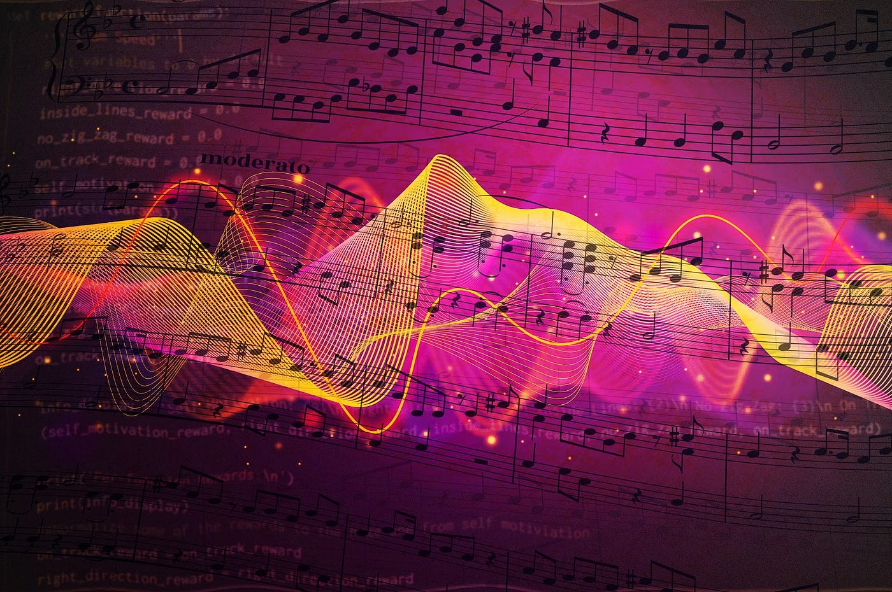

Software Engineering often has a common trope of being very logical and less creative and malleable. But this is often not the case, which can be seen through the usages of design patterns in Software Engineering. Like a mold used for baking, or a chord used in music, design patterns tackle a problem by modifying a simple foundation for a solution. We’ll explore in this essay how design patterns have altered the way that I thought about software engineering, and how it’s like ‘the music of design.’

## Design Patterns are Chords

Music is so wonderful because of its complexity of mixing different types of instruments, sounds, tempo, and other melodic differences. But music wouldn’t be so interesting if it was just one chord, right? But chords are so fundamental in music, that it would be boring if they didn’t exist at all. That's an analogy to how design patterns seem to work in the computer science realm. They are very important, especially for the efficiency of code, but also provide a solid foundation to build a solution. But what exactly are design patterns? Design patterns are solutions that are easily modified and reusable for problems within a given context. Algorithms themselves are a design pattern since they are all very situational, which makes them useful in only certain contexts. Sometimes using bubble sort is much more useful than merge sort, depending on what type of data set or structures you are trying to use it on. In my Software Programming class this semester, I had to deal with modifying, evaluating, and creating complex structures of code. This can get complicated for a programmer, so it is good to have an organized way of methodizing your understanding of the code you create. With that in mind, design patterns are beneficial when crafting code that performs well and is understandable by your peers.

Design patterns help us make organized, easy-to-understand code. They're like the special notes that make a song catchy. Instead of figuring out everything from scratch, we use these patterns to make our code sound good and work well.

## Design Patterns are Key

Alright, let me share a story about my coding adventures! Picture a band playing together, each member doing their thing. That's like a computer program where different parts need to work together. I used something called the Observer pattern, which is like having a band leader (or conductor) who tells everyone when to play.

This way, when one part of the program changes, all the other parts know about it and can adjust. It's like magic teamwork, and it keeps the code from getting messy. Just like a band playing in sync, my program runs smoothly without any chaos.

In another coding adventure, I felt like a musician who can switch between playing jazz and rock without missing a beat. This time, I used the Strategy pattern. It's like having different musical styles (or strategies) in your pocket and picking the one that fits the moment.

In my program, I could easily switch between different ways of doing things without messing up the whole song. It's like being a musical chameleon, adapting to what the program needs at any given time.

## The Grand Finale: Making Code Look and Sound Awesome

Now, let's imagine the final act of our music show. The Composite pattern is like building a song from simple notes and combining them to make a powerful melody. It's a bit like creating a big music piece from smaller, easy-to-handle parts.

Using these design patterns is like having secret weapons to make my code super cool. They help me create programs that are easy to understand, flexible, and work smoothly. It's like being a composer who makes everyone in the audience say, "Wow, that sounds amazing!"

So, when someone asks about design patterns, it's like sharing the story of how you composed a fantastic music piece for computers. It's not just coding; it's about making a symphony of awesome functionality with a touch of magic!
