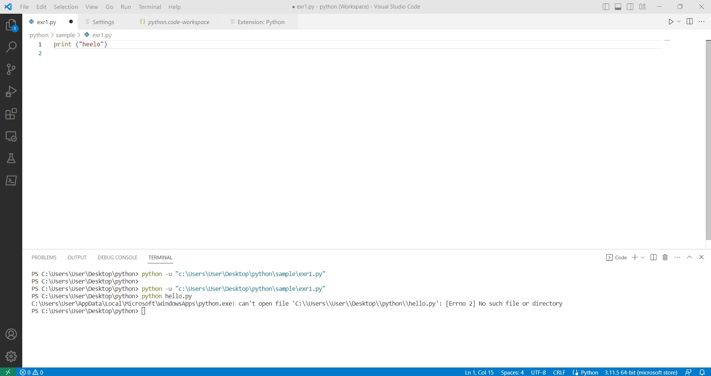

Just like accidentally leaving a light on, or forgetting to check if there is someone behind you while opening a door, there are small things that we can mindlessly forget to check or do. But imagine after lending a pencil to someone in class, forgets to mention that they will need it for the whole day. Or when someone asks you to buy them food, they never mention what type of food they really want and get mad after you can’t read their mind. When these senseless mishaps occur while asking for help, this is infuriating for the person offering their time to you. I realized how important it is to not ask “dumb questions” after looking through Eric Steven Raymond’s online article ‘How To Ask Questions The Smart Way.’  Raymond brings up how small but frustrating things people do when asking questions to hackers on online programming forums. Raymond explains how we, as users asking for help, can stop asking "dumb questions."

## DUMB & DUMBER

To demonstrate, I will be taking actual queries from a website called Stack Overflow, which is a major question-and-answer forum used for topics on programming. Below is an example of a bad example of how to pose a question on Stack Overflow and sites alike (sorry user SuperbCurve24, you just happen to be an example of someone asking a dumb question). Below is the question asked:

```
Q: Visual Studio code

Hello I am new to Python and Visual studio code. When I tried to run my code this is what it's showing in the terminal. what should i do? (enter image description here) <-- link to screenshot of code

I installed the extension of python in VS I dont know what went wrong
```

This question received 5 downvotes, with only one response to their post. Additionally, there is a user asking the question “What exactly are you asking?” making it really clear that this user obviously posed an unclear, and undetailed question, making it difficult for people to help solve their issue. Let’s now deconstruct the issues with this posed question.

 First of all, the user provides a very unclear title to their question: Visual Studio code. What about visual studio code is wrong? Although they mention their issue in the body, at first glance, people wouldn’t understand the issue they are facing. So, they should instead title their question as “Visual Studio Code ‘No such file’ Error” or as Raymond’s suggested format: “Running Python using Visual Studio Code - No such file error.” This clear and concise subject header would let others clearly understand what they would need help with.
	
Another issue with this user’s post is that rather than posting the actual code and error into the forum, they sent a screenshot of the error that occurred. Raymond mentions how screenshots make it difficult to easily access the person's code without having to type out the code themselves. This totally makes sense, because how are you expected to fix the code, if you aren’t given the ability to run it? That was another mistake that this person made while uploading their question.



Lastly, this person didn’t give a detailed explanation of what they did, or what they attempted to do to solve the problem on their own. Raymond in his web article suggests mentioning how you looked on Google for an answer already, listing the other methods you tried to do (uninstalling and redownloading VS, checking the Python extension, etc.) before forcing someone else to solve your problem. This user only mentions that he had installed the Python extension, but has no idea what the problem is, seems like they themselves put little effort into solving the problem. Now let's take a look at a question that sets itself up properly.

## SMARTER & SMARTER

```
Q: Javascript - how to avoid writing the same function on every individual page script without using globals

I am building a multi-page web-app in HTML/CSS/JS/jQuery + Vite.js. This is a question about best practices.

There are over 24 pages in the app, so it's a fairly large codebase. I have been building the whole thing myself (for a small startup) and attempting to follow best practices so that it's not a nightmare for another developer to take over someday. One issue I keep running into is how to deal with basic functions that every page uses, such as checkLogin (runs on page load) or hideSections(arr) (pass in array of dom elements to hide). In those scenarios, is it better to define the functions over and over on each page, or to define it globally in a main script that all pages can access? While I'm aware that (globals are bad) <-- link to another Stack Overflow forum, I'm struggling with how to avoid potentially having to make changes to one function over and over on each individual page script.

How can I be mindful of scoping, maintainability, readability, and all the other issues associated with global variables, while also avoiding rewriting the same function and having to make edits on every individual page script?

Thanks in advance for any thoughts and helpful references.

```
 
User Mickey Versbow is what user SuperbCurve24 wanted to be. Let's start with the header for their question. The difference between the two questions is also very evident in the number of responses and upvotes (Mickey Versbow received no downvotes, and 4 answers to their question). Let's dissect what this user did differently to make them an exemplary question-asker. They first make aware of what programming language they are working with (Javascript) and add the problem they are attempting to solve (how to avoid writing the same function on every individual page script without using globals). This allows people who are scrolling through the multiple questions that are posted on Stack Overflow daily, to know what their issue is and what they want to solve. 

This user also gives a lot of relevant information that sets up the problem that he is facing within the body of his question. For example, he mentions how he is attempting to build a multi-page web app and the issue he is running into. This gives people looking over his question a lot more information to work with.
	
For his question, it doesn’t deal much with the actual code like SuperbCurve24 did, so he didn’t put any code into his forum. But what he did do that SuperbCurve24 didn’t do, is demonstrate how he put in effort to solve the problem himself. He realized how globals are bad, and cited another Stack Overflow page where he learned about global variables. This demonstrates to people reading his question that he did attempt to learn more about his problem, and is not just taking an easy route by having others solve the issue for him.

Another small, but noticeable detail that this questioner does is in advance, thanking people for providing their thoughts and references. This is not needed when posting on a forum, but it definitely incentivizes others to respond, by showing that they are grateful for any help they received. Overall, all these small details that this user does in their question demonstrate how to ask a purposeful, and concise question on Stack Overflow.

## DUMB OR SMART QUESTION?

Now that we reviewed the difference between a “dumb” question and a “smart” question, we can clearly see the results of how important it is to format and provide as much information in your question as possible. After learning the right way of asking a question from Raymond’s web article, we should all strive to act like Mickey Versbow, not SuperbCurve24. Now when your teacher tells you that there are no dumb questions, you can tell them there are, and redirect them to Stack Overflow. Just make sure it’s not you asking the dumb question.
