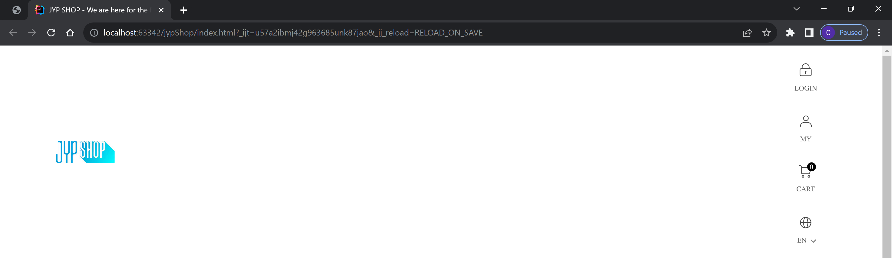
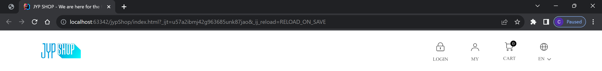
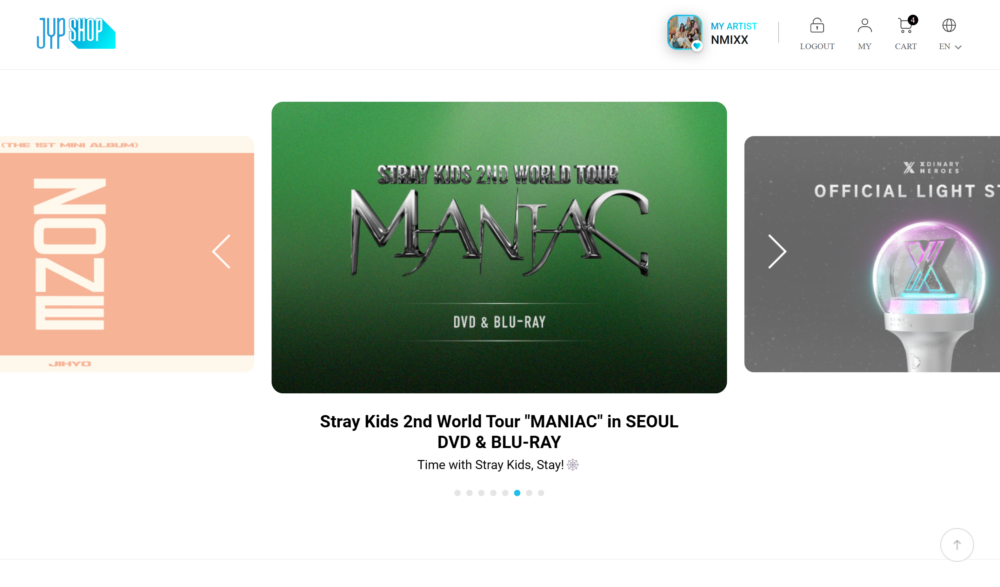

The title is very wrong: you can definitely build a home without a blueprint. Would the house have a built-in sauna and pool? No, but it might satisfy your basic needs for a home. It might be stable enough to support whoever lives in it, but it might be nothing to brag about. I use this analogy to represent understanding Twitter Bootstrap, or any other framework for that matter. It is exactly as described: a framework. For my software engineering class, we worked on a module that required us to use Twitter Bootstrap and served as an introduction to HTML frameworks. While I found utilizing Twitter Bootstrap in my projects very difficult, I think the end result that it can produce when developing websites justifies its trickiness.

## A Blueprint Written in Spanish

I just love analogies, so here is another one. Working with Twitter Bootstrap as a framework for my project was like having the blueprint to build your house, but it is entirely written in Spanish. You might be able to make out some words that are similar in English to get the gist of what you need to do, but it still is a major headache to understand, if you don’t understand the language. This is exactly how I felt while developing my websites while using Twitter Bootstrap. The problem is that if you don’t understand the documentation for the framework, it becomes nearly impossible to implement it on your site.  It makes it even worse if your HTML and CSS knowledge is very limited, and I am lucky that I have a general understanding of both HTML and CSS. So something I learned while working with Twitter Bootstrap was to make sure you understand the process exactly, knowing what specific parts of the code do what, which will make it easier to understand the issues you might come across later on with your code.

For example, while developing a mockup of the JYP shop website using Bootstrap 5 for my software engineering class, I couldn’t figure out how to make the icons within my navbar line up correctly:



But when looking back at the Twitter Bootstrap Documentation, I noticed that I missed a section within the introduction to adding the navbar to a site. The documentation states how you need to wrap the navbar element with .navbar-expand-sm in order to apply responsive collapsing. With just the addition of navbar-expand-sm within the navbar element, It correctly fixed my website to display as shown below:



This very minuscule addition to my code made all the difference within the layout of my navbar. This kinda shows how technical you have to be when using a framework, by making sure you clearly understand every part of the documentation to achieve the desired look.

## My Blueprint

As I mentioned before, to better understand Bootstrap, I worked on a project of recreating the JYP shop store website. The JYP shop store is an online store for a large K-pop entertainment company. What really attracted me to recreate this site was just my overall interest in K-pop, and realizing that recreating the website is reasonably achievable.

While working on this project, a major setback for me was my limited knowledge of Bootstrap. As I mentioned before, the better you can understand the documentation, the easier it is to implement the many design choices that Bootstrap offers. My problem was not getting a good overview of how Bootstrap operates, which made it take a bit more time than needed to complete the recreation. What I liked about Bootstrap while creating this project was the customization of the different elements of your website. For example, when developing my navigation bar, you could add the logo to the top left corner of the bar very easily, and you can add a dropdown page to the links on the navigation bar. These are features that may have taken a lot more code and time to develop if you were to simply use HTML and CSS, but by utilizing the framework’s library, you could easily add these elements to your page with little coding. Adding the logo to the corner of the navigation bar was just by using a navbar-brand element, and then simply wrapping your image inside it. For creating the dropdown menu, you create a nav-link element, then include the data-bs-toggle="dropdown" within that element. Here is a passage of code that shows how I crafted the navigation bar for my site:

```html
  <div class="container">
    <a class="navbar-brand">
      
    </a>
      <ul class="navbar-nav justify-content-end">
        <li class="nav-item">
          <a class="nav-link" href="#">
            
          </a>
        </li>
        <li class="nav-item">
          <a class="nav-link" href="#">
            
          </a>
        </li>
        <li class="nav-item">
          <a class="nav-link" href="#">
            
          </a>
        </li>
        <li class="nav-item dropdown">
          <a class="nav-link" id="navbarDropdown" role="button" data-bs-toggle="dropdown" aria-expanded="false" href="#">
            
          </a>
          <ul class="dropdown-menu" aria-labelledby="navbarDropdown">
            <li><a class="dropdown-item" >KR</a></li>
            <li><a class="dropdown-item" href="#">ENG</a></li>
            <li><a class="dropdown-item" href="#">JPN</a></li>
            <li><a class="dropdown-item" href="#">CHN</a></li>
          </ul>
        </li>
      </ul>
  </div>
```

Overall, using a framework such as Twitter Bootstrap while recreating my website was very helpful in giving the website greater customization than using just HTML and CSS. To show how a framework comes in handy for creating a website, here is my website using Twitter Bootstrap, versus the actual website:

<b>Real </b>


<b>Recreation </b>


## A House with a Sauna and Pool

Twitter Bootstrap really pushes the envelope of not only just doing something to get it done but to understand exactly what you are doing, before doing it. In the realm of computer science, this seems to be an underlying theme of becoming a great software developer. You need to really dig deep into understanding these core concepts, and a strong foundation on computer science ideas before you can do amazing things with the languages. Twitter Bootstrap and HTML frameworks in general kind of represent that idea of really applying yourself to understand to how things work. So really, you can build a house without a blueprint. But to become a great construction manager, you better start making a blueprint as soon as possible, or your client is going to be unhappy with the house they get. 

