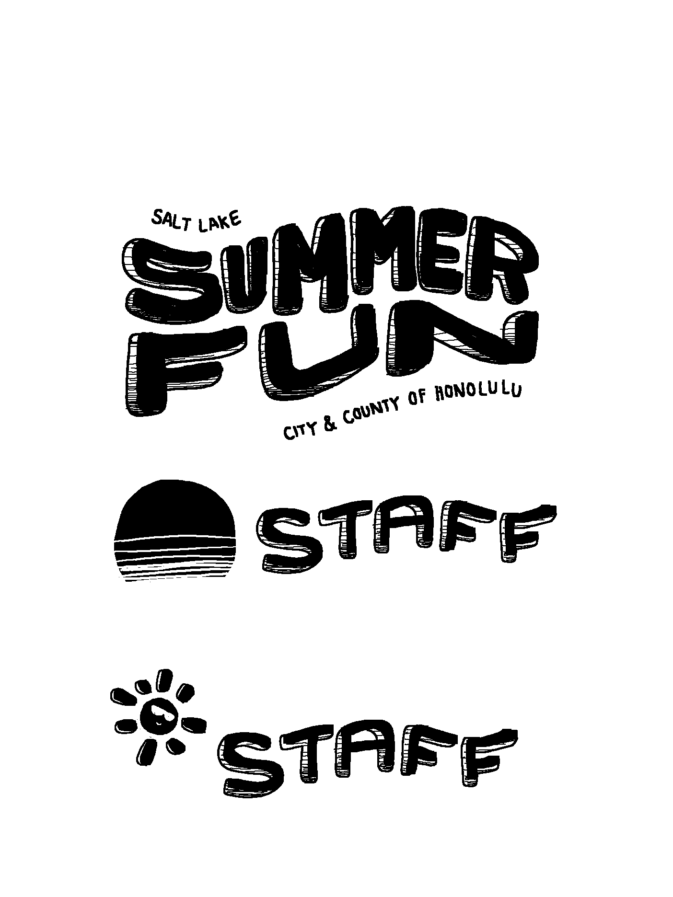
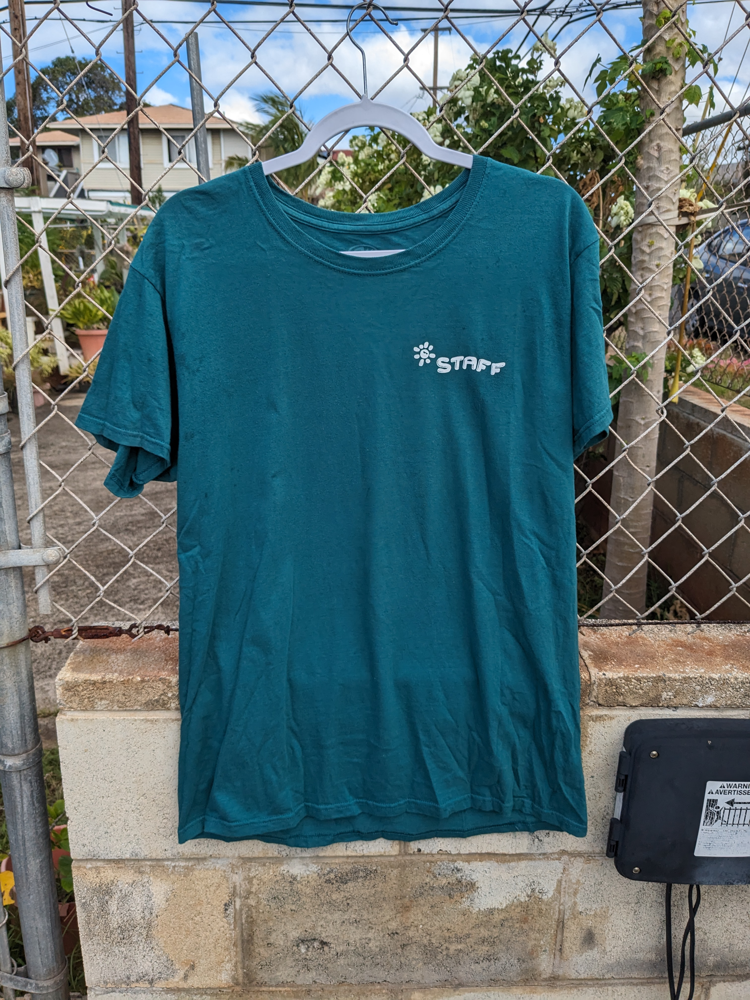

Besides software engineering, I have an interest in and passion for graphic design. It started when I would watch graphic designers on YouTube analyze company logos, describing how the form and color of the logos impact its connotation. I always had an interest in art as a kid, so logo design has naturally become an interest in mine as well. 

As a child, I used to attend a program in Hawaii called Summer Fun, which is a city & county summer program that keeps kids busy with activities and sports during the summer. During my sophomore year of college, the program asked me to help them create a graphic for their 2021 shirt design. I gladly accepted it because it seemed like a fun side project I could commit to during the summer. The next challenge was to come up with the actual design for the shirt.

Luckily, the program gave me a free range of how the shirt looked, so I came up with multiple ideas and let them choose the graphic that they preferred. I first started my process by coming up with words that reminded me of summer, to match the right connotations of the shirt: waves, summer, beach, camping, sun, etc. With these ideas, I played with different fonts and vectors until I came up with my first drafts below:

  
  
  

After these initial rough ideas, I created a 2nd draft by separating the designs into coherent themes:

  
  
  

After proposing these ideas, they really liked the last design with the flowy font, which I also agreed was one of my favorites. They ended up going with this final design, with the sun as a chest design.

  
  
  

Creating my first ever graphic design that would be showcased and used in public was a very enriching experience, that was also very fun. I am excited to incorporate my graphic design into my software engineering, maybe through web design.

